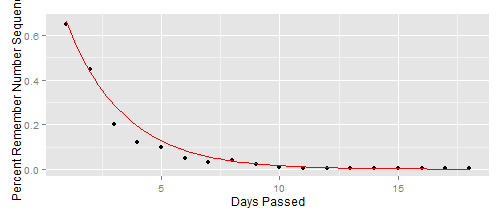

## Here is a screenshot of the app interface
Note that there are two tabs on the sideBarPanel, one for inputting your values, and one for documentation explaining how to use the app.


---

## Use Case

* Maybe you have some data that follows an exponential decay curve
* You need to choose the correct curve
* Example: "Forgetting Curve"
  - The forgetting curve hypothesizes the decline of memory retention in time. This curve shows how information is lost over     time when there is no attempt to retain it.

---

## Example - Forgetting Curve
The points represent the percent of people who still remembered a number sequence after a certain number of days.


```r
g<-ggplot(data=forgetDat, aes(x,y)) + geom_point() 
g<-g+ stat_function(fun = mydecayfxn, args=list(a1=-.7, b1=1.7, d1=1), col = "red") 
g<-g+ xlab("Days Passed") + ylab("Percent Remember Number Sequence")
g
```

 

---
How did we know what function to use?
## Use the Decay Functions App! 

You can play around with the parameters in the function $y = exp(a*(x/b)^k)$ 

- $a$ (multiplier) 
- $b$ (lengthscale), and 
- $k$ (power) 

in order to come up with the best fit for your data.
